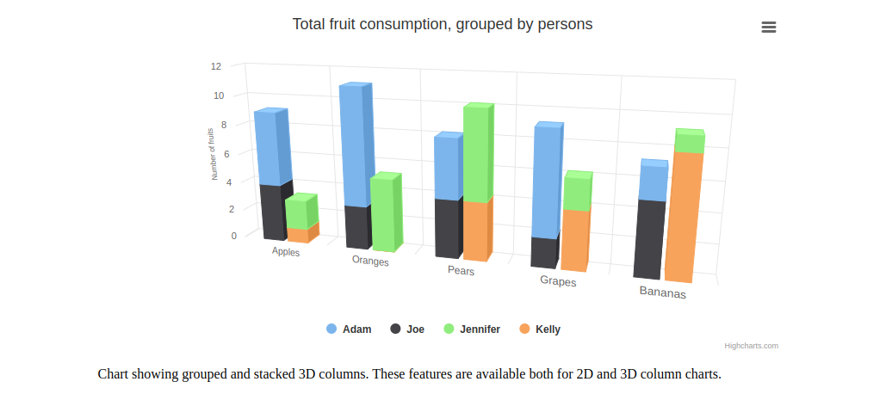

**Getting started:-**

We start off by creating a folder named **Stacked 3D columns with highchart**. We open this folder in an editor. I am using Atom for it. Having done that, we will create a file named ‘index.html’ which will be storing the Html structure of our web page.

**Creating index.html file:-**

We give our web page the title **“Stacked 3D columns with highchart”**. We include css in our project with the following code:-

`<link rel="stylesheet" href="css/style.css">`

and highchart from external cdn link

`    <script src="https://code.highcharts.com/highcharts.js">
    </script>
    <script src="https://code.highcharts.com/highcharts-3d.js">
    </script>
    <script src="https://code.highcharts.com/modules/exporting.js">
    </script>
    <script src="https://code.highcharts.com/modules/export-data.js">
    </script>
    <script src="https://code.highcharts.com/modules/accessibility.js">
    </script>
    `

We also include jQuery in our project with the following code:-

`<script src="js/jquery-3.6.0.js"></script>`

and we include custom jQuery code in our project with the following code:-

`<script src="js/custom.js"></script>`

**index.html file**

```html
<!DOCTYPE html>
<html>
    <head>
        <title>
            Stacked 3D columns with highchart
        </title>
        <link href="css/style.css" rel="stylesheet">
        </link>
    </head>
</html>
<body>
    <figure class="highcharts-figure">
        <div id="container">
        </div>
        <p class="highcharts-description">
            Chart showing grouped and stacked 3D columns. These features are
        available both for 2D and 3D column charts.
        </p>
    </figure>
    <script src="js/jquery-3.6.0.js">
    </script>
    <script src="https://code.highcharts.com/highcharts.js">
    </script>
    <script src="https://code.highcharts.com/highcharts-3d.js">
    </script>
    <script src="https://code.highcharts.com/modules/exporting.js">
    </script>
    <script src="https://code.highcharts.com/modules/export-data.js">
    </script>
    <script src="https://code.highcharts.com/modules/accessibility.js">
    </script>
    <script src="js/custom.js">
    </script>
</body>

```

**style.css file**

```css

#container {
    height: 400px;
}
.highcharts-figure, .highcharts-data-table table {
    min-width: 310px;
    max-width: 800px;
    margin: 1em auto;
}
.highcharts-data-table table {
    font-family: Verdana, sans-serif;
    border-collapse: collapse;
    border: 1px solid #EBEBEB;
    margin: 10px auto;
    text-align: center;
    width: 100%;
    max-width: 500px;
}
.highcharts-data-table caption {
    padding: 1em 0;
    font-size: 1.2em;
    color: #555;
}
.highcharts-data-table th {
    font-weight: 600;
    padding: 0.5em;
}
.highcharts-data-table td, .highcharts-data-table th, .highcharts-data-table caption {
    padding: 0.5em;
}
.highcharts-data-table thead tr, .highcharts-data-table tr:nth-child(even) {
    background: #f8f8f8;
}
.highcharts-data-table tr:hover {
    background: #f1f7ff;
}


```

**custom.js file:-**

```js
Highcharts.chart('container', {
    chart: {
        type: 'column',
        options3d: {
            enabled: true,
            alpha: 15,
            beta: 15,
            viewDistance: 25,
            depth: 40
        }
    },
    title: {
        text: 'Total fruit consumption, grouped by persons'
    },
    xAxis: {
        categories: ['Apples', 'Oranges', 'Pears', 'Grapes', 'Bananas'],
        labels: {
            skew3d: true,
            style: {
                fontSize: '16px'
            }
        }
    },
    yAxis: {
        allowDecimals: false,
        min: 0,
        title: {
            text: 'Number of fruits',
            skew3d: true
        }
    },
    tooltip: {
        headerFormat: '<b>{point.key}</b><br>',
        pointFormat: '<span style="color:{series.color}">\u25CF</span> {series.name}: {point.y} / {point.stackTotal}'
    },
    plotOptions: {
        column: {
            stacking: 'normal',
            depth: 40
        }
    },
    series: [{
        name: 'Adam',
        data: [5, 8, 4, 7, 2],
        stack: 'male'
    }, {
        name: 'Joe',
        data: [4, 3, 4, 2, 5],
        stack: 'male'
    }, {
        name: 'Jennifer',
        data: [2, 5, 6, 2, 1],
        stack: 'female'
    }, {
        name: 'Kelly',
        data: [1, 0, 4, 4, 8],
        stack: 'female'
    }]
});


```

# Output



***